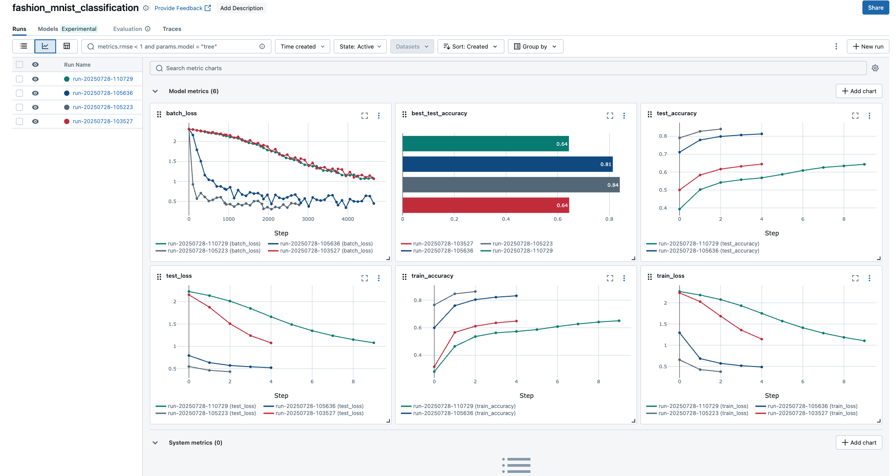

# PyTorch_demo

[English](README_EN.md) | [中文](README_CN.md)

## About This Project | 关于本项目

This project demonstrates how to use PyTorch with MLflow for model training, tracking, and evaluation.

这个项目演示了如何使用 PyTorch 和 MLflow 进行模型训练、跟踪和评估。

## Quick Start | 快速开始

```bash
# Install dependencies | 安装依赖
pip install -r requirements.txt

# Train model | 训练模型
python pytorch_demo.py

# View experiments | 查看实验
mlflow ui

# Evaluate model | 评估模型
python evaluate.py --run-id <RUN_ID> --log-mlflow
```

## Project Structure | 项目结构

- `pytorch_demo.py`: Main training script with MLflow integration | 集成了MLflow的主训练脚本
- `evaluate.py`: Independent evaluation script | 独立的评估脚本
- `requirements.txt`: Project dependencies | 项目依赖
- `README_EN.md`: Detailed English documentation | 详细的英文文档
- `README_CN.md`: Detailed Chinese documentation | 详细的中文文档

## Documentation | 文档

For detailed documentation, please refer to:
- [English Documentation](README_EN.md)
- [中文文档](README_CN.md)

详细文档请参考：
- [英文文档](README_EN.md)
- [中文文档](README_CN.md)

1. 独立评估脚本
- 项目中包含一个独立的评估脚本 `evaluate.py`，可以从MLflow加载训练好的模型并进行评估。
- 使用方法：
  ```bash
  python evaluate.py --run-id <RUN_ID> --batch-size 64 --log-mlflow
  ```
  其中：
  - `<RUN_ID>` 是MLflow实验运行的ID，可以从MLflow UI中获取
  - `--batch-size` 可选参数，指定评估时的批次大小
  - `--log-mlflow` 可选参数，如果提供则将评估结果记录回MLflow
- 评估脚本会生成:
  - 详细的分类报告（classification_report.json）
  - 混淆矩阵可视化（confusion_matrix.png）
  - 错误分类样本可视化（misclassified_examples.png）
- 这种训练与评估解耦的方法是自动化测试的基础，便于CI/CD集成和模型的持续评估。个项目文件夹，使用venv或conda创建虚拟环境。
- 安装必要的库：pip install torch torchvision numpy pandas scikit-learn mlflow。
2. 编写基础训练脚本 (不含MLflow)
- 加载torchvision自带的MNIST数据集。
- 定义一个简单的卷积神经网络（CNN）模型（可以直接从PyTorch官方教程复制）。
- 编写训练和评估函数。
- 在训练结束后，在测试集上进行评估，并手动打印混淆矩阵和分类报告（使用scikit-learn）。
- 目标：先跑通一个能正常工作的基线版本（Baseline）。
3. 集成MLflow Tracking
- 改造脚本：在训练脚本中引入mlflow。
- mlflow.start_run()：将你的训练和评估代码包裹起来。
- mlflow.log_param()：记录本次实验的超参数，例如：学习率（learning rate）、批量大小（batch size）、训练轮次（epochs）。
- mlflow.log_metric()：在每个epoch结束时，记录训练损失（loss）和验证准确率（validation accuracy）。在最终测试后，记录测试集上的所有关键指标（Accuracy, Precision, Recall, F1-Score）。
- mlflow.log_artifact()：记录输出产物。
- 将scikit-learn生成的混淆矩阵图保存为图片（e.g., confusion_matrix.png），然后记录它。
    - 将完整的分类报告保存为文本文件（e.g., classification_report.txt），然后记录它。
    - mlflow.pytorch.log_model()：将训练好的PyTorch模型（.pth文件）作为一个MLflow模型记录下来。
4. 实验与分析
- 在项目目录下运行 mlflow ui。
- 现在，你的脚本已经准备好了。保持你的 mlflow ui 窗口开着，然后打开一个新的终端（确保进入了正确的虚拟环境和项目目录），开始你的“参数测试”.
- 进行对比实验：修改超参数（例如，尝试不同的学习率 0.01, 0.001），多次运行你的脚本。
- 在MLflow UI中分析：
    - 对比不同“Run”的参数和最终指标，找出效果最好的那次实验。
    - 点击进入某次“Run”的详情页，查看Metrics随时间变化的图表。
    - 在"Artifacts"中，直接预览你保存的混淆矩阵图和分类报告。
- 核心体验：感受MLflow如何让你的每次模型“测试”都变得有据可查、可追溯、可对比。

5. 一个简单的CI流水线（以GitHub Actions为例）： 
- 触发器：当代码合并到main分支时触发。 
- 执行训练：运行pytorch_demo.py 脚本，所有结果自动记录到MLflow Server。 
- 执行评估：运行evaluate.py脚本，加载刚刚训练出的模型。
- 质量门禁（Quality Gate）：脚本判断模型的关键指标（如Accuracy）是否大于预设阈值（例如0.98）。 
- 自动晋级：如果通过门禁，则通过API调用，将MLflow Registry中的模型版本从“Staging”更新为“Production”。如果失败，则流水线报错。 
- 测试要点：这就是将模型评估融入到CI/CD中，实现了AI质量的自动化监控。

## **综合分析**

### **第一步：理解核心指标的含义**

假设我们正在做一个**多分类任务**（比如MNIST手写数字识别，0-9共10个类别）。

#### **1. Loss (损失)**

*   **`train_loss` / `validation_loss` (训练/验证损失)**:
    *   **含义**: 模型预测结果与真实标签之间的“差距”。这个值越低，说明模型在**对应数据集上**拟合得越好。
    *   **如何评估**:
        *   **持续下降**: 一个健康的训练过程，`train_loss` 和 `validation_loss` 都应该随着epoch的增加而稳步下降。
        *   **观察拐点**: 当 `validation_loss` 不再下降甚至开始上升时，通常意味着模型开始**过拟合 (Overfitting)**。这是停止训练的最佳时机（早停法 Early Stopping 的原理）。
        *   **绝对值**: 损失的绝对值本身意义不大（因为它受损失函数、数据规模等影响），**关键在于它的变化趋势**。

*   **`final_loss` / `test_loss` (最终/测试损失)**:
    *   **含义**: 模型在**从未见过**的测试集上的损失。这是对模型**泛化能力**的最终度量。
    *   **如何评估**: 在多个实验中，`test_loss` **最低**的那个模型通常是我们想要的候选者之一。

#### **2. Accuracy (准确率)**

*   **`test_accuracy` (测试准确率)**:
    *   **含义**: 在测试集上，模型预测正确的样本数占总样本数的比例。这是最直观的性能指标。 `Accuracy = (TP + TN) / (TP + TN + FP + FN)`
    *   **如何评估**:
        *   **越高越好**: 显而易见，我们希望准确率尽可能高。
        *   **设定基线 (Baseline)**: 一个模型的准确率是`98%`，这算好还是坏？你需要一个比较基准。
            *   **随机猜测基线**: 对于10分类问题，随机猜的准确率是`10%`。`98%`远高于此，说明模型学到了东西。
            *   **业务基线**: 这个任务在业务上要求的最低准确率是多少？比如，低于`95%`就不可接受。
            *   **业界基线 (SOTA)**: 在公开的MNIST数据集上，目前最好的模型准确率能达到`99.7%`以上。`98%`虽然不错，但还有提升空间。
        *   **警惕数据不平衡**: 如果90%的样本都是类别“1”，模型只要无脑猜“1”就能达到90%的准确率。这时 `Accuracy` 就有很强的误导性。因此，我们需要更细致的指标。

#### **3. Precision, Recall, F1-Score (通常通过`classification_report`查看)**

这些指标能帮你深入分析模型在**每个类别上**的表现，尤其是在数据不平衡时至关重要。

假设我们特别关注数字“8”的识别情况：

*   **Precision (精确率/查准率)**:
    *   **含义**: 在所有被模型预测为“8”的样本中，有多少是真的“8”？
    *   **公式**: `TP / (TP + FP)`
    *   **业务场景**: 在垃圾邮件检测中，你希望Precision高。因为你不想把重要的邮件（非垃圾）错误地判断为垃圾邮件（FP）。**宁可漏过，不可错杀**。

*   **Recall (召回率/查全率)**:
    *   **含义**: 在所有真实为“8”的样本中，有多少被模型成功地找了出来？
    *   **公式**: `TP / (TP + FN)`
    *   **业务场景**: 在疾病诊断（如癌症检测）中，你希望Recall高。因为你不想漏掉任何一个真正的病人（FN）。**宁可错杀，不可漏过**。

*   **F1-Score (F1分数)**:
    *   **含义**: Precision和Recall的调和平均数，是它们的综合考量。
    *   **公式**: `2 * (Precision * Recall) / (Precision + Recall)`
    *   **如何评估**: 当你希望Precision和Recall都表现良好时，F1-Score是一个很好的单一评估指标。

---

### **第二步：结合MLflow UI进行评估的实战流程**

现在，打开你的MLflow UI，面对着多行实验结果，按照这个思路来分析：

#### **1. 宏观筛选 (找到“好学生”)**

1.  **按主要指标排序**: 点击 `test_accuracy` 列的表头进行降序排序，或者点击 `test_loss` 列进行升序排序。这会让你立刻锁定表现最好的几个实验（Run）。
2.  **排除异常**: 有没有`test_accuracy`极低的实验？点击进去看看它的参数，可能是学习率过高导致模型不收敛。有没有`test_loss`在训练过程中不下降反而上升的？这可能是梯度爆炸或者其他训练问题的信号。这些是“坏学生”，可以先忽略。

#### **2. 深入分析 (对比“好学生”之间的差异)**

假设你找到了两个表现最好的实验：
*   **Run A**: `test_accuracy = 0.985`, `test_loss = 0.05`
*   **Run B**: `test_accuracy = 0.982`, `test_loss = 0.04`

这时该选哪个？`Accuracy`更高但`Loss`也更高。

1.  **检查过拟合情况**:
    *   分别点击进入Run A和Run B的详情页。
    *   查看`validation_loss`和`train_loss`的曲线图。
    *   哪个模型的`validation_loss`和`train_loss`之间的**差距更小**？差距更小的那个模型通常**泛化能力更好**，即使它的`test_accuracy`略低一点，也可能是一个更稳健、更值得信赖的模型。

2.  **查看详细的分类报告 (Artifacts)**:
    *   在两个Run的详情页中，找到你上传的产物（Artifacts），打开 `classification_report.txt` 文件。
    *   **对比每个类别的F1-Score**。可能Run A的总体准确率高，但是它在识别数字“5”和“3”时（这两个数字长得像）的F1-Score很低。而Run B虽然总体准确率略低，但它在所有类别上的表现都很均衡。
    *   **根据业务需求选择**: 如果你的业务对所有数字的识别性能要求都很平均，那么**模型B可能更好**。如果你的业务只关心把“1”和“7”分开，那么就看这两个类别上的指标。

3.  **查看混淆矩阵 (Artifacts)**:
    *   打开 `confusion_matrix.png`。
    *   混淆矩阵的**对角线**代表预测正确的数量，我们希望对角线上的颜色最深。
    *   **非对角线**上的亮点就是模型犯错的地方。例如，如果"真实标签=3，预测标签=5"这个格子里的数字很大，说明模型经常把“3”误判为“5”。
    *   对比Run A和Run B的混淆矩阵。哪个模型的非对角线“更干净”？它犯的错误模式是否可以接受？

---

### **总结：一个完整的评估Checklist**

当你评估一个模型时，可以问自己以下问题：

1.  **【主要目标】** `test_accuracy`是否达到了业务基线？在所有实验中是否是最高的？
2.  **【泛化能力】** `test_loss`是否是最低的？`validation_loss`和`train_loss`的差距是否过大（过拟合）？
3.  **【鲁棒性/均衡性】** `classification_report`中，有没有某个类别的F1-Score特别低？模型的表现是否均衡？
4.  **【具体错误】** `confusion_matrix`揭示了哪些具体的错误模式？这些错误模式在业务上是否是致命的？
5.  **【成本考量】** 达到最高精度的模型，是不是用了更多的`epochs`（训练时间更长）或更复杂的结构（推理时间更长）？在精度相差无几的情况下，选择**成本更低**的模型。